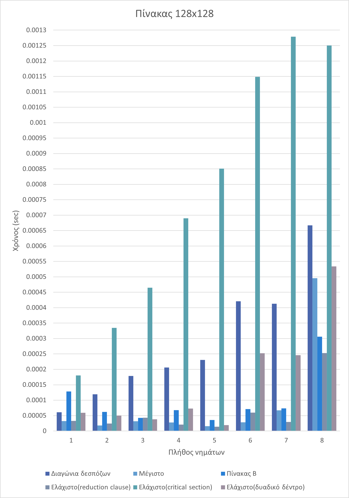

# Parallel Algorithms on Matrix

## Description

This project was part of [Parallel Systems](http://www.ice.uniwa.gr/education/undergraduate/courses/parallel-systems/) cource.

Using parallel computing algorithms the asks of this assignement is:
- Check if the imported matrix is symmetrical and diagonally dominant.
- Search the maximum value of the diagonal using the reduction clause
- Create a new matrix with the same dimensions following the rules:
    - $𝐵_{𝑖𝑗} = m – |𝐴{𝑖𝑗}|$ for $i \neq j$
    - $𝐵_{𝑖𝑗} = m$ for $i=j$
    
- For the new matrix B search the minimum value with the methods:
    - Reduction clause
    - Without reduction clause
        - Critical Section
        - binary tree

For each task, time was measured 

## Installation

This project requires a C compiler and the openMP library.

## Usage
In **array** file is used to import data

**makefile** targets:


```bash
    # Compile and run program
    make

    # Compile and run in debug mode
    make debug
```

## Results




